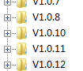
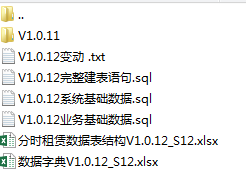
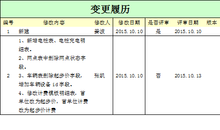

# 数据库命名规范

## 约定
>   尽量满足3NF
>   所有字段值都是不可分解的原子值;也就是说在一个数据库表中，一个表中只能保存一种数据，不可以把多种数据保存在同一张数据库表中;
>   每一列数据都和主键直接相关，而不能间接相关.

## 表命名规范

  * 表命名根据业务区分，添加前缀
  1 租赁业务 使用 rt 作为前缀 （rental）
  2 电桩业务 使用 etr 作为前缀 （electric）
  3 优惠业务 使用 cp 作为前缀 （coupon）
  4 管理平台 使用 sys 作为前缀 （system）

## 字段规范

  * 每行记录必须唯一,如无特殊情况,主键使用`bigint`自增主键,长度为20位
  * 时间使用`datetime`类型
  * 每个表都要求包含`created_at`(创建时间),`created_by`(创建人),`updated_at`(修改时间),`updated_by`(修改人),`remarks`(备注),`del_flag`(删除标识)等六列.
  * 用`del_flag`标记删除数据,数据新建默认值为0,如果删除则修改为1.
  * 字段命名全小写,使用下划线区分
  * 尽量使用非空列

## 使用规范

  * 在表查询中，一律不要使用*作为查询的字段列表，需要哪些字段必须显式写明。
  * 在表查询中，作`Order By`排序时，优先使用主键列，索引列。
  * 避免嵌套连接，例如：`A = B` **and** `B = C` **and** `C = D`
  * 尽量避免`Union`操作的使用
  * 尽量不适用视图和临时表
  * 在表查询中，一律不要使用* 作为查询的字段列表，需要哪些字段必须显式写明。
  * 在表查询中，作`Order By`排序时，优先使用主键列，索引列。
  * 尽量少用嵌套查询，过多嵌套会严重的降低数据库性能，在使用时要注重其合理性。
  * 修改记录时，必须有`Where`唯一条件

# 版本升级/版本管理
## 版本维护

    每个迭代都维护一版数据库信息

 

    每个版本都记录依赖于上一版本的变动,方便系统升级.
    在这个迭代开发完毕以后,记录数据库的完整建表语句,系统基础数据,业务基础数据.
    记录这些数据的原因是如果有需求需要单独部署一份某迭代的服务,不需要从第一个迭代开始执行sql脚本来回复数据库.
    在变动表结构的时候,需要在 变动文档内记录 sql.同时在表结构文档做好修改.

 

## 表结构文档维护

    在变动表结构之前,填写变更履历,记录本次变动的内容原因修改人等信息.具体参考下表:

 

    修改表格页需要把字段中文名称,字段英文名称,数据类型,位数,是否为空,备注等列填写.
    如果是状态位,需要在备注中详细说明不同的数字代表什么意义
