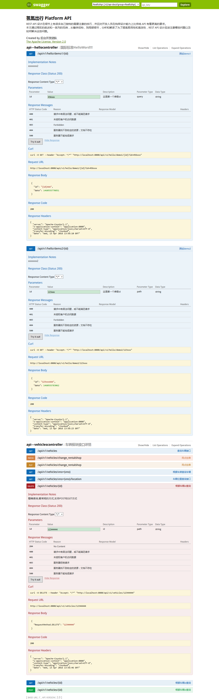

# spring-boot-swagger2 使用手册

### 在项目中常用的注解说明

| **注解** | **属性** | **值** | **备注** |
|---------|---------|------|------------|
| `@Api` | value | 字符串 | 可用在`class`头上,`class`描述 |
|        | description | 字符串 |  |
| | | | `@Api`(value = "xxx", description = "xxx") |
| `@ApiOperation` | value | 字符串 | 可用在方法头上.参数的描述容器 |
|                 | notes | 字符串 |  |
| | | | `@ApiOperation`(value = "xxx", notes = "xxx") |
| `@ApiImplicitParams` | {} | `@ApiImplicitParam`数组 | 可用在方法头上.参数的描述容器 |
| | | | `@ApiImplicitParams`({`@ApiImplicitParam1`,`@ApiImplicitParam2`,...}) |
| `@ApiImplicitParam` | name         | 字符串 与参数命名对应  | 可用在`@ApiImplicitParams`里 |
|                     | value        | 字符串 | 参数中文描述 |
|                     | required     | 布尔值 | true/false |
|                     | dataType     | 字符串 | 参数类型 |
|                     | paramType    | 字符串 | 参数请求方式:query/path |
|                     |              |       | query:对应`@RequestParam`?传递 |
|                     |              |       | path: 对应`@PathVariable`{}path传递 |
|                     | defaultValue | 字符串 | 在api测试中默认值 |
| | | | 用例参见项目中的设置 |
| `@ApiResponses` | {} | `@ApiResponse`数组 | 可用在方法头上.参数的描述容器 |
| | | | `@ApiResponses`({`@ApiResponse1`,`@ApiResponse2`,...}) |
| `@ApiResponse`      | code         | 整形   | 可用在`@ApiResponses`里 |
|                     | message      | 字符串 | 错误描述 |
| | | | `@ApiResponse`(code = 200, message = "Successful") |


### 1.Demo结构
> `Maven pom`

```xml
<?xml version="1.0" encoding="UTF-8"?>
<project xmlns="http://maven.apache.org/POM/4.0.0"
         xmlns:xsi="http://www.w3.org/2001/XMLSchema-instance"
         xsi:schemaLocation="http://maven.apache.org/POM/4.0.0 http://maven.apache.org/xsd/maven-4.0.0.xsd">
    <modelVersion>4.0.0</modelVersion>

    <groupId>com.reachauto.hkr.cxn</groupId>
    <artifactId>cxn-demo-swagger2</artifactId>
    <version>1.0-SNAPSHOT</version>

    <parent>
        <groupId>org.springframework.cloud</groupId>
        <artifactId>spring-cloud-starter-parent</artifactId>
        <version>Angel.SR6</version>
    </parent>

    <dependencies>
        <dependency>
            <groupId>org.springframework.boot</groupId>
            <artifactId>spring-boot-starter-web</artifactId>
        </dependency>
        <dependency>
            <groupId>org.springframework.boot</groupId>
            <artifactId>spring-boot-starter-actuator</artifactId>
        </dependency>

        <!-- Swagger -->
       <dependency>
            <groupId>io.springfox</groupId>
            <artifactId>springfox-swagger-ui</artifactId>
            <version>2.2.2</version>
        </dependency>
        <dependency>
            <groupId>io.springfox</groupId>
            <artifactId>springfox-swagger2</artifactId>
            <version>2.2.2</version>
        </dependency>
        <!-- END Swagger -->

    </dependencies>

    <build>
        <plugins>
            <plugin>
                <groupId>org.springframework.boot</groupId>
                <artifactId>spring-boot-maven-plugin</artifactId>
            </plugin>
        </plugins>
    </build>

</project>

```

> `SwaggerConfig` 配置

```java
import com.google.common.base.Predicate;
import org.springframework.beans.factory.annotation.Value;
import org.springframework.context.annotation.Bean;
import org.springframework.context.annotation.Configuration;
import org.springframework.http.ResponseEntity;
import springfox.documentation.service.ApiInfo;
import springfox.documentation.spi.DocumentationType;
import springfox.documentation.spring.web.plugins.Docket;
import springfox.documentation.swagger2.annotations.EnableSwagger2;

import static com.google.common.base.Predicates.or;
import static springfox.documentation.builders.PathSelectors.regex;

/**
 * SwaggerConfig
 */
@Configuration
@EnableSwagger2
public class SwaggerConfig {

    @Value("${server.servlet-path}")
    private String pathMapping;

    private ApiInfo initApiInfo() {
        ApiInfo apiInfo = new ApiInfo("XXX项目 Platform API",//大标题
                initContextInfo(),//简单的描述
                "1.0.0",//版本
                "服务条款",
                "后台开发团队",//作者
                "The Apache License, Version 2.0",//链接显示文字
                "http://www.baidu.com"//网站链接
        );

        return apiInfo;
    }

    private String initContextInfo() {
        StringBuffer sb = new StringBuffer();
        sb.append("REST API 设计在细节上有很多自己独特的需要注意的技巧，并且对开发人员在构架设计能力上比传统 API 有着更高的要求。")
                .append("<br/>")
                .append("本文通过翔实的叙述和一系列的范例，从整体结构，到局部细节，分析和解读了为了提高易用性和高效性，REST API 设计应该注意哪些问题以及如何解决这些问题。");

        return sb.toString();
    }


    @Bean
    public Docket restfulApi() {
        System.out.println("http://localhost:8080" + pathMapping + "/swagger-ui.html");

        return new Docket(DocumentationType.SWAGGER_2)
                .groupName("RestfulApi")
//				.genericModelSubstitutes(DeferredResult.class)
                .genericModelSubstitutes(ResponseEntity.class)
                .useDefaultResponseMessages(true)
                .forCodeGeneration(false)
                .pathMapping(pathMapping) // base，最终调用接口后会和paths拼接在一起
                .select()
                .paths(doFilteringRules())
                .build()
                .apiInfo(initApiInfo());
    }

    /**
     * 设置过滤规则
     * 这里的过滤规则支持正则匹配
     * @return
     */
    private Predicate<String> doFilteringRules() {
        return or(
                regex("/hello.*"),
                regex("/vehicles.*")
        );
    }
}
```

> `Controller` 的配置

```java

import com.reachauto.hkr.cxn.swagger.bean.ChangeRentalShopParameter;
import io.swagger.annotations.*;
import org.slf4j.Logger;
import org.slf4j.LoggerFactory;
import org.springframework.ui.ModelMap;
import org.springframework.web.bind.annotation.*;

import java.util.Date;

/**
 * Created by cxn on 2016/2/24.
 */
@Api(value = "API - VehiclesController", description = "车辆模块接口详情")
@RestController
@RequestMapping("/vehicles")
public class VehiclesController {

    private static Logger logger = LoggerFactory.getLogger(VehiclesController.class);


    @ApiOperation(value = "查询车辆接口", notes = "此接口描述xxxxxxxxxxxxx<br/>xxxxxxx<br>值得庆幸的是这儿支持html标签<hr/>", response = String.class)
    @ApiImplicitParams({
            @ApiImplicitParam(name = "vno", value = "车牌", required = false,
                    dataType = "string", paramType = "query", defaultValue = "辽A12345"),
            @ApiImplicitParam(name = "page", value = "page", required = false,
                    dataType = "Integer", paramType = "query",defaultValue = "1"),
            @ApiImplicitParam(name = "count", value = "count", required = false,
                    dataType = "Integer", paramType = "query",defaultValue = "10")
    })
    @ApiResponses(value = {
            @ApiResponse(code = 200, message = "Successful — 请求已完成"),
            @ApiResponse(code = 400, message = "请求中有语法问题，或不能满足请求"),
            @ApiResponse(code = 401, message = "未授权客户机访问数据"),
            @ApiResponse(code = 404, message = "服务器找不到给定的资源；文档不存在"),
            @ApiResponse(code = 500, message = "服务器不能完成请求")}
    )
    @ResponseBody
    @RequestMapping(value = "", method = RequestMethod.GET)
    public ModelMap findVehicles(@RequestParam(value = "vno", required = false) String vno,
                                 @RequestParam(value = "page", required = false) Integer page,
                                 @RequestParam(value = "count", required = false) Integer count)
            throws Exception {

        logger.info("http://localhost:8501/api/v1/vehicles");
        logger.info("## {},{},{}", vno, page, count);
        logger.info("## 请求时间：{}", new Date());

        ModelMap map = new ModelMap();
        map.addAttribute("vno", vno);
        map.addAttribute("page", page);
        return map;
    }


    @ApiOperation(value = "根据车牌查询车辆", notes = "这种类型的查询是精确查询,其结果只有一条数据", response = String.class)
    @ApiImplicitParams({
            @ApiImplicitParam(name = "vno", value = "车牌", required = false,
                    dataType = "string", paramType = "path", defaultValue = "辽A12345")
    })
    @ApiResponses(value = {
            @ApiResponse(code = 200, message = "Successful — 请求已完成"),
            @ApiResponse(code = 400, message = "请求中有语法问题，或不能满足请求"),
            @ApiResponse(code = 401, message = "未授权客户机访问数据"),
            @ApiResponse(code = 404, message = "服务器找不到给定的资源；文档不存在"),
            @ApiResponse(code = 500, message = "服务器不能完成请求")}
    )
    @ResponseBody
    @RequestMapping(value = "vno={vno}", method = RequestMethod.GET)
    public ModelMap getVno(@PathVariable(value = "vno") String vno)
            throws Exception {

        logger.info("http://localhost:8501/api/v1/vehicles/vno={}", vno);
        logger.info("## 请求时间：{}", new Date());

        ModelMap map = new ModelMap();
        map.addAttribute("vno", vno);

        return map;
    }

    @ApiOperation(value = "车辆位置查询接口", notes = "根据车牌查询车辆位置信息", response = String.class)
    @ApiImplicitParams({
            @ApiImplicitParam(name = "vno", value = "车牌", required = false,
                    dataType = "string", paramType = "path", defaultValue = "辽A12345")
    })
    @ApiResponses(value = {
            @ApiResponse(code = 200, message = "Successful — 请求已完成"),
            @ApiResponse(code = 400, message = "请求中有语法问题，或不能满足请求"),
            @ApiResponse(code = 401, message = "未授权客户机访问数据"),
            @ApiResponse(code = 404, message = "服务器找不到给定的资源；文档不存在"),
            @ApiResponse(code = 500, message = "服务器不能完成请求")}
    )
    @ResponseBody
    @RequestMapping(value = "vno={vno}/location", method = RequestMethod.GET)
    public ModelMap getLocation(@PathVariable(value = "vno") String vno)
            throws Exception {
        logger.info("getLocation");
        logger.info("## 请求时间：{}", new Date());

        ModelMap map = new ModelMap();
        map.addAttribute("vno", vno);

        return map;
    }


    @ApiOperation(value = "根据车辆id查询", notes = "精确查询,最常规的方式,支持POST和GET方式", response = String.class)
    @ApiImplicitParams({
            @ApiImplicitParam(name = "id", value = "id", required = false,
                    dataType = "string", paramType = "path", defaultValue = "12344444")
    })
    @ApiResponses(value = {
            @ApiResponse(code = 200, message = "Successful — 请求已完成"),
            @ApiResponse(code = 400, message = "请求中有语法问题，或不能满足请求"),
            @ApiResponse(code = 401, message = "未授权客户机访问数据"),
            @ApiResponse(code = 404, message = "服务器找不到给定的资源；文档不存在"),
            @ApiResponse(code = 500, message = "服务器不能完成请求")}
    )
    @ResponseBody
    @RequestMapping(value = "{id}", method = {RequestMethod.GET,RequestMethod.POST})
    public ModelMap getById(@PathVariable(value = "id") String id)
            throws Exception {

        logger.info("http://localhost:8501/api/v1/vehicles/{}", id);
        logger.info("## 请求时间：{}", new Date());

        ModelMap map = new ModelMap();
        map.addAttribute("{RequestMethod.GET,RequestMethod.POST}", id);

        return map;
    }
    @ApiOperation(value = "根据车辆id查询", notes = "精确查询,最常规的方式,支持POST和GET方式", response = String.class)
    @ApiImplicitParams({
            @ApiImplicitParam(name = "id", value = "id", required = false,
                    dataType = "string", paramType = "path", defaultValue = "12344444")
    })
    @ApiResponses(value = {
            @ApiResponse(code = 200, message = "Successful — 请求已完成"),
            @ApiResponse(code = 400, message = "请求中有语法问题，或不能满足请求"),
            @ApiResponse(code = 403, message = "服务器拒绝请求"),
            @ApiResponse(code = 401, message = "未授权客户机访问数据"),
            @ApiResponse(code = 404, message = "服务器找不到给定的资源；文档不存在"),
            @ApiResponse(code = 500, message = "服务器不能完成请求")}
    )
    @ResponseBody
    @RequestMapping(value = "{id}", method = {RequestMethod.DELETE})
    public ModelMap delById(@PathVariable(value = "id") String id)
            throws Exception {

        logger.info("http://localhost:8501/api/v1/vehicles/{}", id);
        logger.info("## 请求时间：{}", new Date());

        ModelMap map = new ModelMap();
        map.addAttribute("RequestMethod.DELETE", id);
        return map;
    }


    @ApiOperation(value = "网点挂靠", notes = "嘻嘻嘻嘻嘻嘻嘻嘻嘻嘻嘻嘻嘻嘻嘻嘻", response = String.class)
    @ApiResponses(value = {
            @ApiResponse(code = 200, message = "Successful — 请求已完成"),
            @ApiResponse(code = 400, message = "请求中有语法问题，或不能满足请求"),
            @ApiResponse(code = 401, message = "未授权客户机访问数据"),
            @ApiResponse(code = 404, message = "服务器找不到给定的资源；文档不存在"),
            @ApiResponse(code = 500, message = "服务器不能完成请求")}
    )
    @ResponseBody
    @RequestMapping(value = "change_rentalshop", method = {RequestMethod.PUT,RequestMethod.PATCH})
    public ModelMap changeRentalShop(@RequestBody ChangeRentalShopParameter parameter)
            throws Exception {

        logger.info("http://localhost:8501/api/v1/vehicles/change_rentalshop | {}", parameter);
        logger.info("## 请求时间：{}", new Date());
        ModelMap map = new ModelMap();
        map.addAttribute("网点挂靠", new Date());

        return map;
    }
}

```

> `Application`  启动模块

```java

import org.springframework.boot.SpringApplication;
import org.springframework.boot.autoconfigure.EnableAutoConfiguration;
import org.springframework.context.annotation.ComponentScan;
import org.springframework.context.annotation.Configuration;

@Configuration
@EnableAutoConfiguration
@ComponentScan
public class Application {
	public static void main(String[] args) {
		SpringApplication.run(Application.class, args);
	}
}
```

### 2.演示地址
[http://localhost:8080/api/v1/swagger-ui.html](http://localhost:8080/api/v1/swagger-ui.html)

### 3.架构演示

